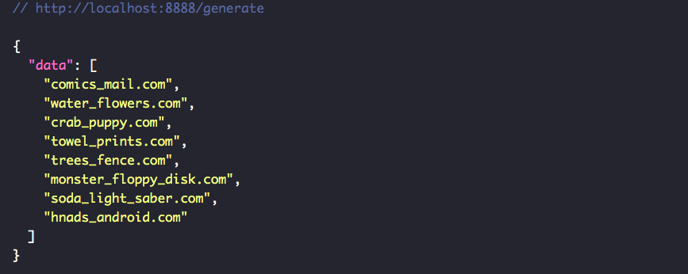

# startup-name-generator

This is a simple rest api that exposes an endpoint "/generate" that generates random cool names for your startup and only 
shows to you names that are available for a .com domain name registrations.

**How it is built:**
- NodeJS (Express)
- http://names.drycodes.com api to Ganerate radom names based on a given topic (in this case it is "startups")
- https://domain-availability.whoisxmlapi.com/api/ REST API for checking if generated names can be registered as a .com domain

**Run it on your own**
- Download NodeJS -> v12 or higher
- Setup an account and create an api key on https://domain-availability.whoisxmlapi.com/
- Put your "domain-availability" api key in ".env file" -> DOMAIN_CHECK_API_KEY
- https://domain-availability.whoisxmlapi.com/api/ REST API for checking if generated names can be registered as a .com domain registration
- ``yarn or npm i -> to install all the dependecies``
- ``yarn start or npm run start -> to launch it``

**Thanks for reading**

